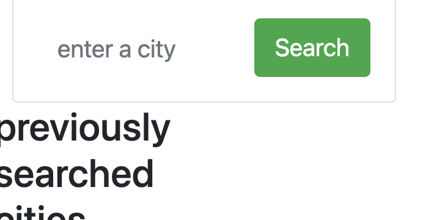

# weather_dashboard
The goal of this project is to create an application that will allow a user to plan their travels appropriately based on weather forecasts for citties they may want to visit. The application must save cities the user searched for into local storage and when selected display city name, the date, an icon representation of weather conditions, the temperature, the humidity, the wind speed, and the UV index. The UV index display will present a color that indicates whether the conditions are favorable, moderate, or severe. Users will be presented wit ha 5-day forecast that displays the date, an icon representation of weather conditions, the temperature, and the humidity. This application will use the OpenWeather API to access necessary weather information and will use localStorage to store the data for previously searched cities. I am the sole editor of this project and will be the only one writing code. This project includes HTML, CSS, and JavaScript files.

link to application:
https://jcorcorangithub.github.io/weather_dashboard/

link to github repo:
https://github.com/jcorcorangithub/weather_dashboard

